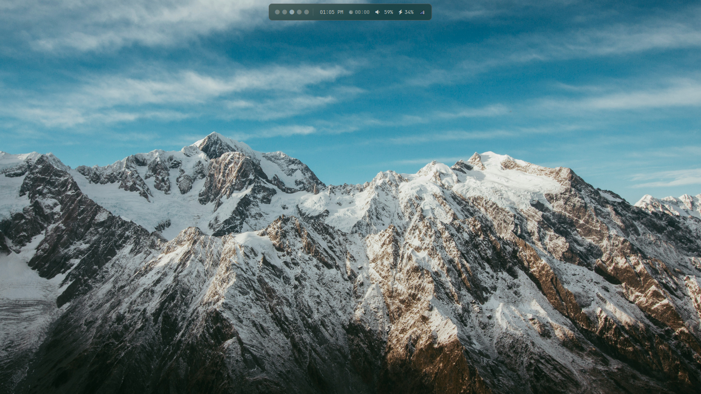
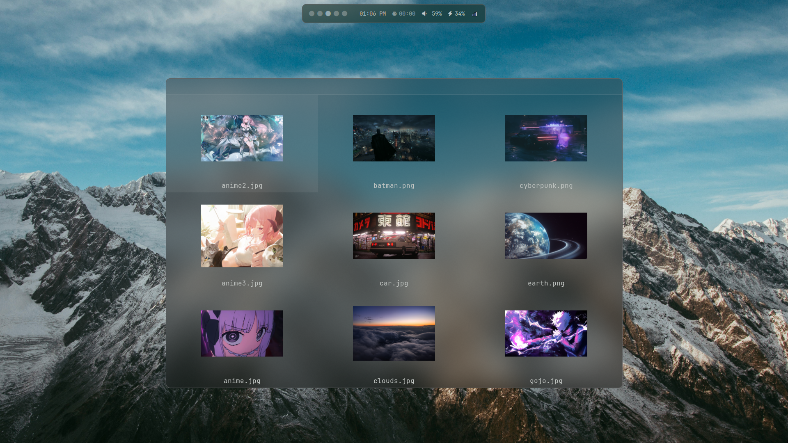
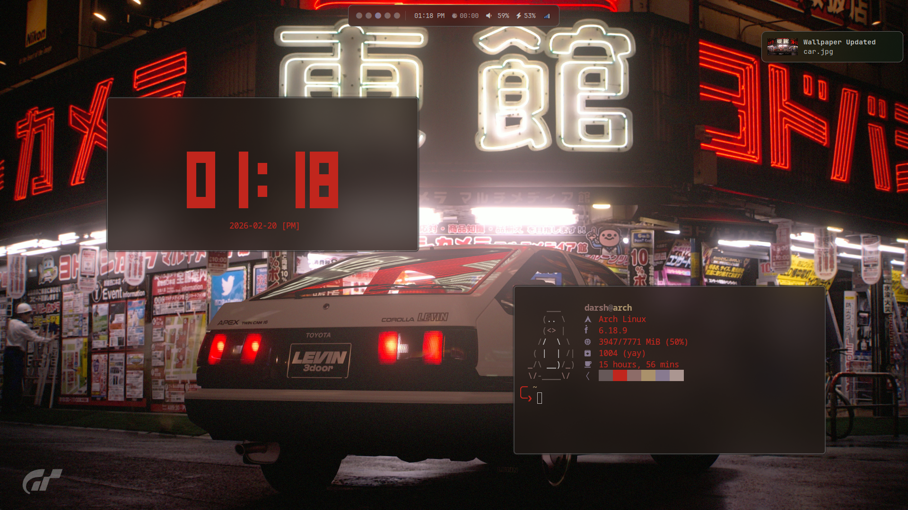
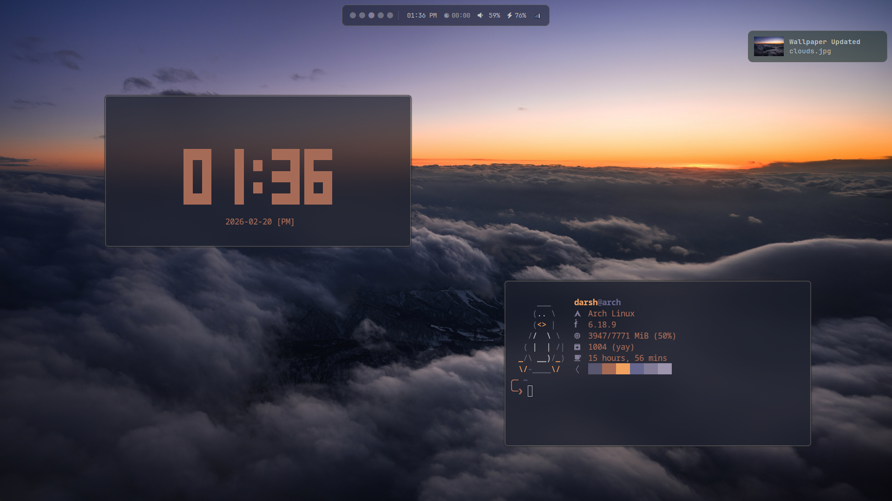

<p align="center">
  
</p>

## Screenshots

### Home
>
> Waybar
<p align="center">
  
</p>

### Rofi
>
> App Launcher, Wallpaper Switcher, Clipboard History, Emoji Picker.
<p align="center">
  
  
</p>
<p align="center">
  
  
</p>

### Wallpapers
>
> Theme colors are generated from the active wallpaper using `pywal`.
<p align="center">
  
  
</p>
<p align="center">
  
  
</p>

## Structure

```text
.config/
├── hypr/           # WM, lock, idle, paper
├── waybar/         # status bar
├── rofi/           # launcher + themes
├── fish/           # shell
├── kitty/          # terminal
├── nvim/           # editor
├── fastfetch/      # fetch config
├── mako/           # notifications
└── starship.toml   # prompt
```

hyprland dotfiles by **[@d1rshan](https://github.com/d1rshan)**
