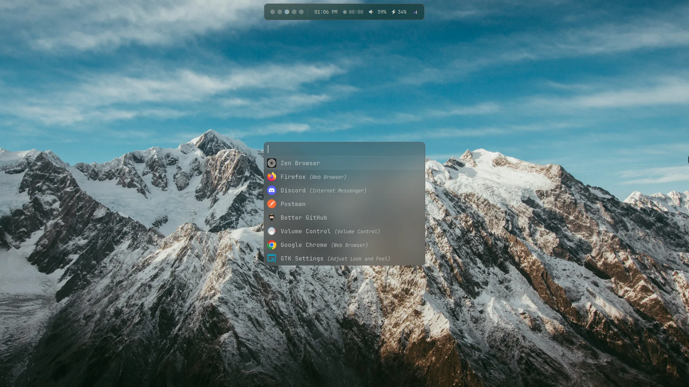
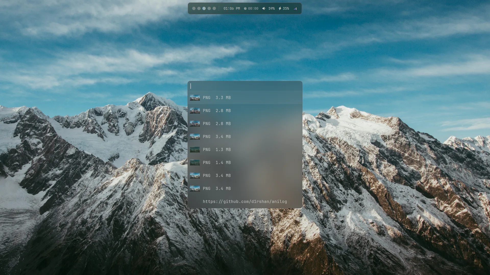
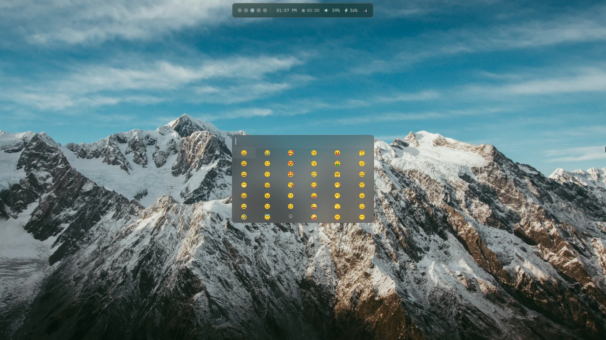
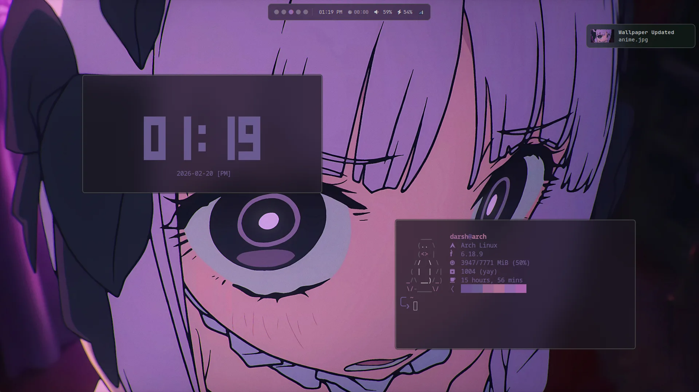
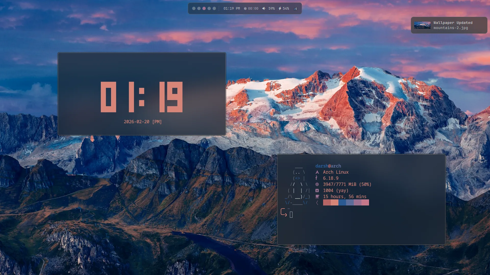

<p align="center">
  
</p>

## Screenshots

### Home
>
> Waybar
<p align="center">
  
</p>

### Rofi
>
> App Launcher, Wallpaper Switcher, Clipboard History, Emoji Picker.
<p align="center">
  
  
</p>
<p align="center">
  
  
</p>

### Theme Palette
>
> Theme colors are generated from the active wallpaper using `pywal`.
<p align="center">
  
  
</p>
<p align="center">
  
  
</p>

## Structure

```text
.config/
├── fastfetch/      # fetch config
├── fish/           # shell
├── hypr/           # WM, lock, idle, paper
├── kitty/          # terminal
├── mako/           # notifications
├── nvim/           # editor
├── rofi/           # launcher + themes
├── waybar/         # status bar
└── starship.toml   # prompt
```

## Star History

<a href="https://www.star-history.com/#d1rshan/dot-files&Date">
  <picture>
    <source media="(prefers-color-scheme: dark)" srcset="https://api.star-history.com/svg?repos=d1rshan/dot-files&type=Date&theme=dark" />
    <source media="(prefers-color-scheme: light)" srcset="https://api.star-history.com/svg?repos=d1rshan/dot-files&type=Date" />
    
  </picture>
</a>

hyprland dotfiles by **[@d1rshan](https://github.com/d1rshan)**
